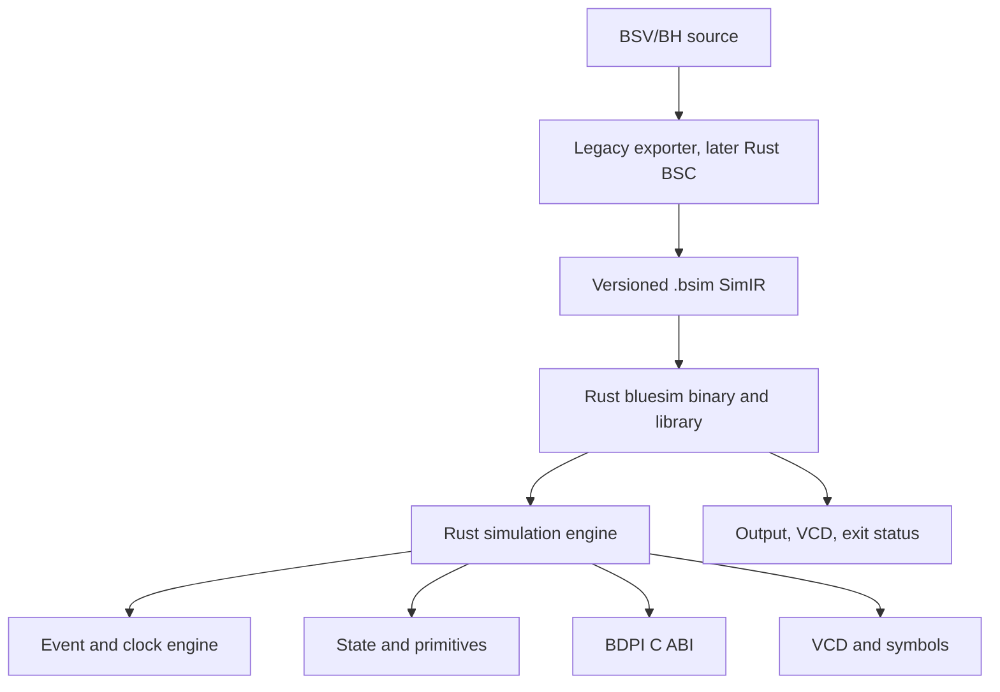
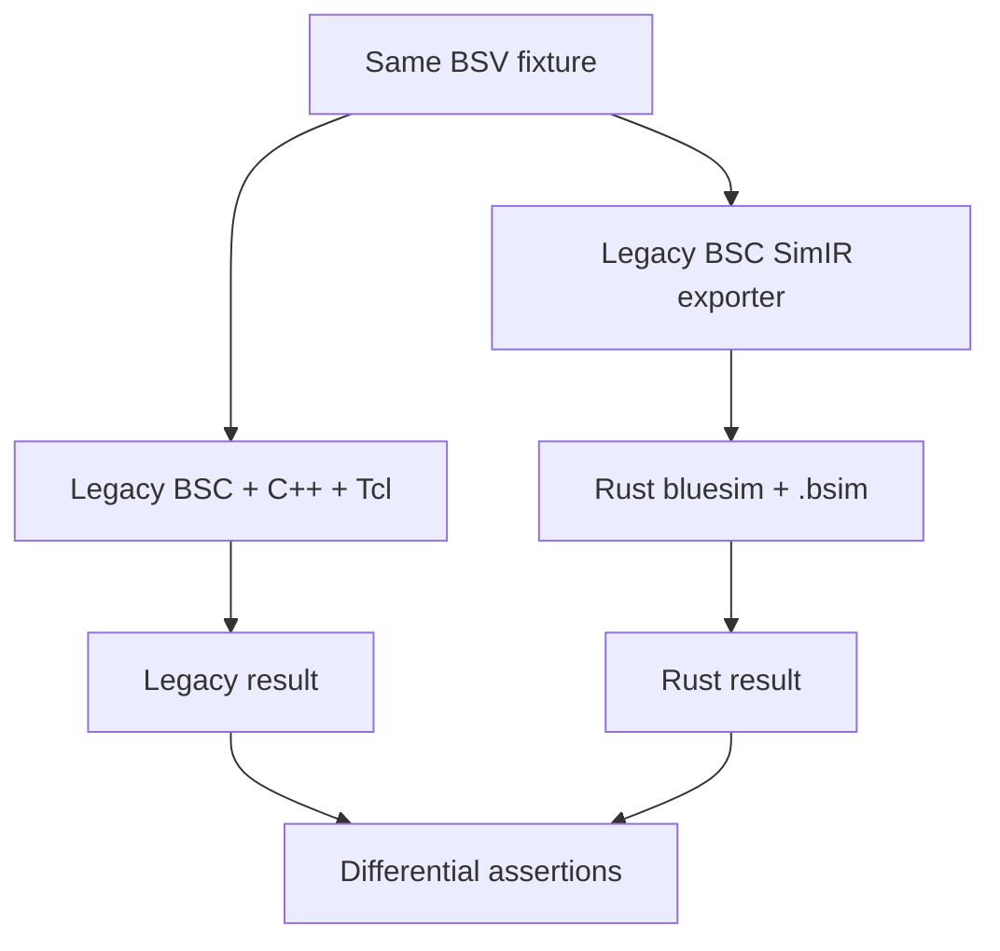

# Bluesim Rust 重写计划

状态：M0/M1、M2a 双时钟/reset 与 M2b hierarchy/method schedule 真实闭环已验证；通用 cross-engine artifact diff 待实现
所属总体计划：[`OVERALL.md`](OVERALL.md) Phase 1
更新时间：2026-08-21

## 1. 最终目标

最终默认链路：

```text
BSV/BH source
→ Rust BSC
→ versioned Bluesim IR artifact (.bsim)
→ Rust bluesim binary
→ stdout/stderr/VCD/exit status
```

最终默认路径不需要：

- generated C++ model；
- C++ Bluesim kernel/primitives；
- Tcl、HTcl 或 `bluesim.tcl`；
- 为每个设计调用外部 C++ compiler；
- 为每个设计生成 Rust source 再调用 `rustc`。

Rust `bluesim` 是通用仿真 binary，直接加载 `.bsim`。如果用户需要单文件 executable，可以后续提供将预构建 Rust launcher 与 `.bsim` 打包的模式，但 canonical artifact 仍是 versioned `.bsim`。

## 2. 为什么 Bluesim 可以先于 Rust BSC

不需要等 BSC 全部重写完才开始 Bluesim。

迁移期链路：

```text
legacy Haskell BSC
→ 临时 SimIR exporter
→ .bsim
→ Rust bluesim binary
```

最终只替换 producer：

```text
Rust BSC
→ 同一 versioned .bsim
→ 同一 Rust bluesim binary
```

这样 Bluesim 与 BSC 通过稳定 artifact 解耦。Rust Bluesim 不读取 Haskell heap，不直接解码当前 `.ba`，也不链接 generated C++。

## 3. 当前 legacy 链路

```text
.ba
→ src/comp/SimExpand.hs
→ SimPackage / SimSystem
→ SimMakeCBlocks.hs
→ SimCCBlock
→ SimCOpt.hs
→ SimBlocksToC.hs
→ generated .h/.cxx
→ C++ compiler
→ model shared library
→ src/bluetcl/bluesim.tcl
→ Bluetcl sim command
→ C++ Bluesim runtime
```

当前 C++/Tcl 的作用仅是：

1. 在迁移期继续提供可工作的 legacy engine；
2. 作为 Rust engine 的 differential oracle；
3. 给旧用户脚本提供有期限的 compatibility path。

新架构不围绕旧 `Model` vtable、`MOD_*` class 或 Tcl object 设计。

## 4. 目标架构



迁移期对跑：



Rust 与 legacy C++ 不在同一进程互调。C++ 是黑盒 oracle，不需要临时 C++ `Model` adapter。

## 5. `.bsim` / SimIR 契约

SimIR 是 BSC 与 Bluesim 的稳定边界，不是 Haskell `SimSystem` 或 C++ class 的直接序列化。

首版使用 versioned JSON，方便审计和 differential debugging。性能与体积成为实测 blocker 后，再增加兼容的 binary encoding；语义 schema 不随 encoding 改变。

### 5.1 必要内容

- schema/version 和 producer metadata；
- top module 与 module hierarchy；
- state cells、bit width、signedness、initial value；
- clocks、resets、period、phase 和 edge schedules；
- rules/methods 的已确定执行顺序；
- combinational expressions；
- state update actions；
- primitive instance 与参数；
- BDPI import signature；
- `$display`、`$time`、`$stop`、`$finish` 等 system tasks；
- symbol/debug metadata；
- VCD signal metadata；
- source/provenance，仅用于诊断和调试。

### 5.2 不包含

- Haskell constructor tags；
- C++ class/vtable/layout；
- Rust struct memory layout；
- host pointer；
- 任意 shell/Tcl command；
- 未版本化 opaque blob。

### 5.3 执行表示

首版采用最小、确定的 Bluesim domain bytecode/table：

- expression stack/register instructions；
- explicit bit widths；
- branch/call-free 或受限控制流；
- ordered state updates；
- stable numeric IDs；
- 不允许 host code injection。

这是仿真语义本身需要的领域 IR，不扩展成通用 VM。只有性能数据证明解释执行不足时，才评估 Cranelift 对相同 SimIR 做 AOT/JIT；不提前维护双后端。

## 6. Rust runtime 边界

### 6.1 Engine

负责：

- lifecycle；
- event queue；
- clock/reset；
- rule/method schedule execution；
- combinational evaluation；
- ordered state commit；
- stop/finish/fatal；
- plusargs。

### 6.2 State/primitives

Rust 原生实现：

- bit vectors 和 wide values；
- reg/wire/probe；
- FIFO/counter；
- clock/reset/synchronizer；
- RegFile/BRAM；
- primitive arithmetic/logic；
- system tasks。

不暴露 Rust crate 内部 layout 为外部 ABI。

### 6.3 BDPI

BDPI 保持稳定 C ABI，因为用户 foreign functions 仍可能是 C/C++：

- scalar width mapping；
- wide `u32` word order；
- return buffer convention；
- string ownership/lifetime；
- dynamic/static foreign library loading。

这不意味着 Bluesim 本身依赖 C++；它只是与用户 native code 的语言中立边界。

### 6.4 SystemC

SystemC 本身是 C++ 生态。若继续支持，保留独立可选 adapter，通过稳定 C ABI 驱动 Rust engine；默认 Bluesim binary 不依赖 SystemC。

### 6.5 CLI/API

Rust `bluesim` 提供：

```text
bluesim run model.bsim
bluesim step model.bsim --cycles N
bluesim inspect model.bsim
bluesim symbols model.bsim --json
bluesim vcd model.bsim --output dump.vcd
```

library API 使用相同 engine，不另建一套 CLI-specific runtime。

## 7. Tcl 迁移

迁移期：

```text
legacy bluetcl/bluesim.tcl → legacy engine
optional bluetcl adapter   → Rust bluesim CLI/API
```

最终：

```text
Rust bluesim CLI/API only
```

原则：

- 不在 Rust 中实现 Tcl interpreter；
- 不把 Tcl list/object 作为新内部协议；
- 旧 `.tcl` automation 迁到 Rust CLI/JSON/library API；
- upstream Bluetcl tests 在迁移期验证 compatibility adapter；
- 默认安装最终移除 Tcl、HTcl 和 `bluesim.tcl`。

## 8. Differential 测试

现有 Rust testsuite 是 Bluesim 重写的迁移控制平面。只扩展当前 canonical Test Plan runner，不建立第二套 Bluesim runner。

开发期 runner 提供显式 engine selector：

```text
--bluesim-engine legacy
--bluesim-engine rust
--bluesim-engine both
```

`both` 必须在两个隔离 workspace 中运行同一个 scenario；cache key、logs 和 artifacts 都包含 engine identity，禁止不同 engine 互相命中缓存或覆盖产物。

2026-08-21 已实现的控制面：

- `bsc-test --bluesim-engine legacy|rust|both`，默认 `legacy`，不影响现有 plan 的默认执行；
- scenario 含 `bsc.simir_export` 或 `simir.m0_step` typed action 时归类 Rust engine，其余保持 legacy；不添加自由形式 shell action 或第二套 runner；
- 显式 `--scenario` 与 selector 不匹配时明确报错，不静默跳过或回退；
- workspace/artifact 路径及 cache fingerprint 均含 `legacy`/`rust` identity；
- `both` 已对 `bluesim-workflow-mkTest`（legacy）和 `simir-m0-mkTest`（Rust）完成一次隔离运行，两端分别匹配同一 upstream golden。

当前 `both` 是双端独立运行并对共同 golden 做差分的控制面，不是将任意 legacy/Rust artifact 两两即时比较的通用 comparator；后者需以显式 typed comparison artifact/action 加入，不能隐式共享工作目录或缓存。

复用：

- `rust/tests/plans`；
- `rust/tests/src/test_plan.rs`；
- `rust/tests/src/bluesim.rs`；
- upstream `testsuite/bsc.bluesim`；
- 所有声明 Bluesim backend/requirement 的 generated plans。

同一 BSV fixture 生成两套结果：

```text
legacy full stack → result A
SimIR + Rust      → result B
```

比较：

- exit status；
- stdout/stderr 与顺序；
- simulation time/clock count；
- state/symbol values；
- VCD；
- `$stop/$finish/$fatal`；
- BDPI calls/results；
- multiple-model isolation；
- error diagnostics。

candidate 失败不得回退到 legacy。

门禁逐步扩大：

1. M0：SimIR exporter/loader validation；
2. M1：一个最小 scenario dual-run；
3. M2：clock/reset/schedule 子集；
4. M3：values/primitives/BDPI；
5. M4：interactive/VCD/symbols；
6. M5：全部 Bluesim 相关 complete plans。

新增测试只覆盖端到端测试难以隔离的不变量：

- event queue timestamp/priority/tie order；
- clock/reset edge order；
- state read-before-write/commit semantics；
- bit widths 0/1/31/32/33/63/64/65；
- signed/wide arithmetic；
- BDPI buffer ownership；
- VCD same-timestamp updates；
- SimIR validation/fuzz/property tests。

## 9. 里程碑

## M0：定义最小 SimIR vertical slice

选择一个只包含：

- 一个 top module；
- 一个 clock/reset；
- 一个 register；
- 一条 rule；
- 一个 `$display`/`$finish`；

的现有 testsuite fixture。

行动：

1. 从 legacy `SimSystem`/`SimCCBlock` 路径识别该 fixture 实际需要的信息；
2. 定义最小 versioned JSON schema；
3. legacy Haskell 临时 exporter 输出 `.bsim`；
4. Rust loader 严格验证 schema、IDs、widths 和 references；
5. 不实现完整 engine，只证明 artifact 可稳定生成和读取。

2026-08-21 侦察结果：

- fixture 选定 `testsuite/bsc.bluesim/interactive/tiny.bsv`；
- exporter seam 已确认在 `src/comp/bsc.hs` 的 `simCOpt` 后、`simBlocksToC` 前；
- legacy `-dsimCOpt` dump 的 M0 语义是：16-bit `count`、周期 10 的 `CLK` 正沿、`count == 100` 优先 `$finish(0)`、否则 `count < 100` 时写入 `count + 1` 并显示写入前值；
- `rust/bluesim` 已实现 schema v1 的严格 loader、`bluesim step/run/inspect` 和上述受限解释器；其 `tiny` fixture 的十步输出逐字匹配 upstream `mkTest_step.out.expected`；
- hidden `bsc -simir <file>` 已在 `simCOpt` 后将该受限 `SimCC` 子集导出为 SimIR；它跳过 `simBlocksToC`、C++ 编译/链接、SystemC wrapper 和 BDPI header；
- exporter 只接受实际观察到的一个 state、一个 clock、`read/write`、`add/equal/unsigned_less_than`、`PrimBNot`、条件、`$time`、`$display`、`$finish` 和初始化 reset tick；其他结构明确失败，不产生部分模型；
- 从 `tiny.bsv` 实际导出的模型已由 Rust `bluesim step --cycles 10` 与 `mkTest_step.out.expected` 字节级一致；`bluesim run --max-cycles 101` 输出 100 行并以 `$finish(0)` 成功退出；过程中不生成/编译 C++、不启动 Tcl、也不按设计调用 `rustc`；
- canonical Test Plan runner 已提供隔离 `legacy/rust/both` engine selector；`simir-m0-mkTest` 可只由 Rust engine 运行，或与 legacy `bluesim-workflow-mkTest` 在 `both` 下各自匹配共同 golden；尚未实现任意 artifact 的通用 cross-engine comparator，因此仍不是完整 testsuite differential gate。

退出条件：

- 连续生成无 diff；
- malformed/unknown-version fail-closed；
- schema 不包含 Haskell/C++ layout；
- fixture provenance 可追踪。

## M1：Rust 最小 simulator binary

实现：

- `.bsim` loader；
- lifecycle；
- 单 clock event queue；
- register read/update；
- 最小 expression execution；
- `$display` 和 `$finish`；
- `bluesim run` CLI。

2026-08-21 验证：

- `simir-m0-mkTest --bluesim-engine rust` 已通过；
- `bluesim-workflow-mkTest` 与 `simir-m0-mkTest --bluesim-engine both` 已通过，legacy 与 Rust 工作目录、artifacts 和 cache identity 相互隔离；
- `testsuite/bsc.bluesim/misc/ClkTest.bsv` 已作为 M1 的第二条真实 fixture：沿用 schema v1，新增仅含静态文本且无 `%` 格式指令的 `$display` lowering，验证重命名 `clk`/`rst`、101 行 `tick!` golden、`finish = 0` 与终止周期优先级；`simulation-sysClkTest` + `simir-m0-sysClkTest --bluesim-engine both` 已通过（3 stages、0 skipped）。

退出条件：

- 与 legacy full stack 对同一 fixture 输出、time 和 exit 一致；
- 不生成/编译 C++；
- 不启动 Tcl；
- 不调用 `rustc` 编译 per-design source。

## M2：执行语义核心

按顺序增加：

1. stable event ordering；
2. multiple clocks；
3. reset；
4. combinational evaluation；
5. rule/method schedule；
6. ordered state commit；
7. stop/finish/fatal；
8. plusargs。

### M2a：双时钟和 initial reset 的已钉定切片

2026-08-21 选择 `testsuite/bsc.bluesim/interactive/MCDTest.bsv` 作为 M2 的首个 fixture。它是当前 testsuite 中最小的真实组合：默认 `CLK`、`mkAbsoluteClock(2, 7)` 产生的 `clk2$CLK_OUT`、一个 default-domain Reg、一个 `clk2` domain Reg，以及 `mkInitialReset(2, clocked_by clk2)`。

`-dsimCOpt` 观察到的 SimCC 只接受以下闭合子集：

- `ClockGen` 的常量参数 `[v1Width, v2Width, initDelay, initValue, otherValue] = [3, 4, 2, 0, 1]`；对应 output clock 的初始 low、首正沿 `t=2`、high phase `3`、low phase `4`，之后正沿为 `2, 9, 16, …`；
- `InitialReset(cycles = 2)`，在 `t=0` assert，在其绑定 clock 的第 2 个有效正沿后于 timeslice 尾部 deassert；
- 两个 `posedge` schedule，固定 source order `CLK` 再 `clk2$CLK_OUT`，无 negedge/after-edge schedule、gating、clock mux/divider 或 async reset；
- normal rule action 后的 InitialReset tick 与 synchronous Reg reset tick；reset tick 覆盖同 edge 的普通 Reg write；
- 既有 M0 expressions/actions 与 `$finish(0)`。

legacy generated model 的该 fixture 最终在 `t=163` `$finish(0)`。这会成为 Rust M2 companion scenario 的 `expectedFinish = 0` 和 `expectedTime = 163`，而非仅检查“跑了若干 cycles”。

M2 使用 **SimIR schema v2**；v1 M0 文件保持原样兼容。v2 runtime 的最小 event queue 与 MCD hand-authored contract 已完成单元验证：双 clock 的正沿按 `(time, clock.order)` 执行，`InitialReset(2)` 的 reset tick 覆盖前两次 `count` write，并在 `t=163` 得到 `$finish(0)`。legacy Haskell exporter 已以严格 primitive/schedule/reset projection 实际导出 `MCDTest.bsv`，并由 Rust loader/runner 成功读取和执行；canonical Test Plan 的 `simir-m2-mkMCDTest` companion scenario 已接入，`--bluesim-engine both` 已与 legacy `bluesim-workflow-2-mkMCDTest` 共同通过。两端保持独立 workspace/artifact/cache；legacy 继续检查 `clock.cmd` Tcl interactive oracle，Rust 则严格检查 SimIR `finish = 0` 和 `time = 163`。

v2 显式表示：

- clock `order`、initial value、first edge、high/low duration；
- initial/default reset 的 assert/deassert 及绑定目标；
- schedule 内受限 `initial_reset_tick` / `reset_tick` actions；
- event sort key `(time, phase, clock.order, sequence)`。

不得从 `SBId`、state tuple 排列、clock name 拼接或 C++ heap 偶然顺序推断语义。exporter 通过 primitive type、精确常量参数、SimCC reset function body、schedule edge/order 和 constant-true gate 逐项验证；任一不匹配即 fail closed。对默认 `CLK`/`RST_N`，M2 仅接受此 fixture 已观察到的 legacy kernel waveform/reset 配置，其他配置先拒绝、后续单独建模。

Rust M2 runtime 将处理一个真实的、稳定排序的 edge event queue：负沿只更新 waveform，正沿运行对应 schedule，普通 action 依 source order 执行，随后 reset tick 覆盖 writes，timeslice 尾部才应用 reset deassert。它不建立 Tcl interpreter、通用 VM 或第二个 test runner。

现有 `clock.cmd` / `mkMCDTest_clock.out.expected` 继续作为 legacy interactive API oracle；M2 Rust companion 只做 SimIR run-to-finish/time differential，不宣称实现 `sim clock` Tcl compatibility。

### M2b：hierarchy、method 与多规则 schedule 的已钉定切片

2026-08-21 选择 `testsuite/bsc.bluesim/interactive/TbGCD.bsv` + `GCD.bsv` 作为下一条真实 fixture。`-dsimCOpt` 表明 legacy scheduler 已把 top rules、submodule rules、ready methods 和 action/value methods排成单一确定优先级链；Rust 路径不需要 C++ class/interface、vtable adapter 或通用 VM。

该切片使用 **SimIR schema v3**（这是 schema 版本，不改变后文迁移 milestone 的编号），仅接受：

- 单个 default `CLK` posedge schedule，无 after-edge；
- 由结构化 `SBId → SimCCBlock` 关系建立的实例树；`SBId` 只用于查块，不进入 artifact identity；
- canonical flat state ID（如 `gcd.the_x`），来自 hierarchy path + RegN instance name，不来自 generated C++ layout；
- RegN 和默认 `RST_N` 初始状态；默认 reset tick 在无外部 reset driver 的 run-to-finish contract 中按已钉定形态忽略；
- schedule-ordered rule/action method 内联、无副作用 value/ready method expression 内联；同名函数若无法由实例对象结构解析，只有全实例树唯一匹配时才接受，否则 fail closed；
- M0/M2 已有 expressions/actions，加 `and` 与 `sub`。

真实闭环已经得到 `finish = 0`、`time = 4760`、`events = 476`。canonical `simir-m3-mkTbGCD` scenario 使用 typed `simir.m3_run` 固定 finish/time；它与 legacy `bluesim-workflow-7-mkTbGCD` 在 `--bluesim-engine both` 下共同通过（9 stages、0 skipped），两边仍使用隔离 workspace/artifacts/cache。legacy 继续验证六组 Tcl interactive golden；Rust companion 验证 hierarchy/method/schedule 的 run-to-finish 语义，不宣称 Tcl debug API 已迁移。

实施时必须同步：

1. `src/comp/SimIR.hs` 的 v2/v3 fail-closed projection；
2. `rust/bluesim` 的 v1/v2/v3 loader、validator、event queue 和 unit tests；
3. typed Test Plan action 及 `scenario_engine` 识别；
4. `rust/util/testsuite-manifest/src/plan.rs` 的 hash-pinned `simir-m2-mkMCDTest` / `simir-m3-mkTbGCD` companion scenario；
5. generated plans/schema/index（通过既有更新命令生成，不手改）。

退出条件：

- schedule、clock/reset 和基本 Bluesim plans differential 一致；
- order 不依赖 hash/random iteration；
- property tests 覆盖明确不变量；
- 有性能基线。

## M3：Values、primitives 与 BDPI

按族扩展：

1. narrow/wide/signed values；
2. reg/wire/probe；
3. FIFO/counter；
4. clock/reset/synchronizer；
5. RegFile/BRAM；
6. primitive ops/system tasks；
7. BDPI。

每族独立加 SimIR opcode/schema、runtime 实现和 differential fixtures。

退出条件：

- 不再依赖 legacy C++ primitive；
- BDPI ABI fixtures 通过；
- wide/signed semantics 与 legacy 一致。

## M4：VCD、symbols 与 interactive CLI

实现：

- symbol hierarchy/lookup/value；
- state/rule dump；
- VCD definitions/updates/checkpoint；
- run/step/sync/inspect；
- structured JSON output；
- optional migration-period Bluetcl adapter。

退出条件：

- interactive/debugging/VCD plans 一致；
- Rust CLI/API 是默认入口；
- Windows 不依赖 Tcl 或 shell quoting；
- adapter unload/session 没有悬挂资源。

## M5：全量 parity 与默认切换

行动：

- 所有相关 complete plans 运行 legacy/Rust differential；
- Windows 与 Unix CI；
- 记录启动时间、吞吐、内存和 `.bsim` 体积；
- Rust engine 成为默认；
- legacy C++/Tcl 继续有限期 CI oracle。

退出条件：

- 无未解释行为/artifact 差异；
- 性能回归已测量并明确接受；
- rollback selector 清楚但不静默；
- 默认安装运行 Bluesim 不需要 C++ compiler 或 Tcl。

## M6：Rust BSC 接管 SimIR producer

当 Rust BSC 对应 pipeline 可用后：

```text
legacy Haskell exporter → Rust BSC SimIR producer
```

对同一 source 比较两边 `.bsim` 的结构和运行结果。Rust producer 稳定后删除 legacy exporter、generated C++ generator 和 C++ runtime build/install 路径。

## M7：可选性能编译后端

仅当 profiling 证明解释执行是实际 blocker：

- 保持同一 versioned SimIR；
- 优先评估 Cranelift 编译 hot blocks 或完整 model；
- interpreter 继续作为 reference engine；
- 不改变 `.bsim`、CLI、BDPI 或测试契约。

没有数据则停在 Rust interpreter/table engine，不增加 JIT/AOT 复杂度。

## 10. Rust 生态复用

| 能力 | 首选 | 约束 |
|---|---|---|
| CLI | 已有 `clap` | 不自造 argv parser |
| SimIR | 已有 `serde` / `serde_json` | schema versioned、deny unknown where appropriate |
| errors | `thiserror` / 已有 `anyhow` | library 与 CLI 分层即可 |
| ordered IDs/maps | `indexmap` | 不依赖随机 iteration |
| event queue | 先 `std::collections::BinaryHeap` | stable tie 用显式 sequence ID |
| bit values | `bitvec` + `num-bigint` | 不暴露内部 layout |
| dynamic BDPI loading | `libloading` | 不手写 Win32/Unix loader |
| C ABI | `core::ffi` / `libc` | 只用于 BDPI/SystemC compatibility |
| VCD | 先验证已有 `vcd` crate | 不改变 legacy observable semantics |
| property tests | `proptest` | SimIR/value/event invariants |
| fuzzing | `cargo-fuzz`，需要时 | 只针对 loader/decoder trust boundary |
| benchmarks | `criterion`，需要时 | 首先使用端到端基线 |
| optional codegen | Cranelift，M7 才评估 | 不提前进入依赖图 |

不引入：Tokio、Tcl interpreter、自研通用 VM、自研动态加载器、自研 bigint、新测试 runner、per-design generated Rust + `rustc` 默认链路。

## 11. 风险与控制

| 风险 | 控制 |
|---|---|
| SimIR 复制 Haskell internals | 只表达仿真语义，schema review + versioning |
| interpreter 性能不足 | 先测量；M7 可在同一 IR 上加 Cranelift |
| event/order 语义偏差 | explicit stable IDs + full differential |
| primitive 爆炸 | 按族迁移，每族独立 gate |
| BDPI layout mismatch | C ABI probe + boundary width fixtures |
| VCD 文本差异 | exact golden + semantic comparison |
| global state 泄漏 | per-engine/session ownership + multi-model tests |
| malformed model | strict validation，无 unchecked index/pointer |
| 新旧 producer 漂移 | structural `.bsim` diff + runtime parity |
| compatibility scope 膨胀 | Tcl/C++ 仅作外部 oracle，不进入新核心 |

## 12. 完成定义

Bluesim 重写完成需要：

- canonical artifact 是 versioned `.bsim`；
- Rust `bluesim` binary/library 直接加载 `.bsim`；
- 默认路径不生成/编译 C++，不调用 Tcl；
- state/primitives/VCD/symbol/BDPI 由 Rust engine 执行；
- Rust BSC 成为 `.bsim` producer；
- Windows/Unix 相关 Test Plans 通过；
- legacy full stack 观察期结束；
- C++ generator/kernel/primitives 和 Tcl launcher 从默认 build/install 删除。

## 13. 当前下一步

M0 `tiny`、M2a `MCDTest` 与 M2b `TbGCD/GCD` 均已通过 canonical Rust Test Plan 的真实 `bsc.generate → bsc.simir_export → in-process Rust bluesim` 闭环；对应 legacy/Rust scenarios 已在 `--bluesim-engine both` 下共同通过，并保持隔离 workspace/artifacts/cache。默认候选路径不启动 Tcl、不生成/编译 per-design C++、不调用 per-design `rustc`，失败也不回退 legacy。

下一步优先 probe `testsuite/bsc.bluesim/misc/MulTest.bsv` 的 signed 23/43-bit operands、66-bit result 与 `%0d` 输出；只有先引入正确的 wide/signed value representation 才能接入，禁止因为该 fixture 的具体结果碰巧可放进 `u64` 就截断语义。之后再进入 `interactive/prims.bsv` 的 Wire/FIFO/RegFile/Probe 同周期交互。继续按“真实 SimCC probe → versioned schema → fail-closed exporter → Rust unit contract → typed companion scenario → both gate”推进；不要让只比较 generated C++ 文本的 tests 驱动 runtime 设计，不创建 C++ adapter、Tcl interpreter、通用 VM、JIT 或第二套 runner。
