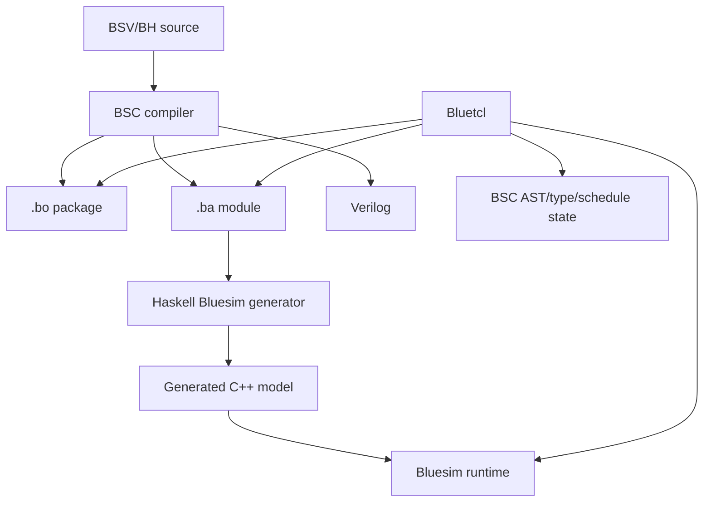

# BSC 工具链 Rust 重写总体计划

状态：提案
更新时间：2026-08-21

## 1. 目标

在不改变上游测试契约和用户可观察行为的前提下，渐进地用 Rust 替换 BSC 工具链中维护成本高、跨平台困难或安全边界薄弱的实现。

目标不是机械地消灭所有 Haskell/C/C++/Tcl，而是形成：

- 可维护的 Rust 主实现；
- 明确、版本化的组件边界；
- legacy 与 Rust 可 differential execution；
- Windows 与 Unix 一致的构建和运行行为；
- 默认安装和核心执行路径不依赖 Tcl；
- 可持续跟进 `B-Lang-org/bsc` 上游测试。

## 2. 项目范围

从用户产品看，核心是三个组件：

1. `bsc`：BSV/BH 编译器、Verilog 后端、Bluesim 模型生成与链接 driver；
2. Bluesim：本机仿真 runtime、primitive、VCD、symbol 和交互控制；
3. Bluetcl：Tcl 命令接口、编译器查询和 Bluesim 会话入口。

必须纳入兼容边界、但不一定全部重写的支撑面：

- 标准 BSV libraries；
- `.bo` / `.ba` 二进制格式；
- Verilog、BDPI/VPI、SystemC；
- `bsc2bsv`、`dumpbo`、`dumpba`、`showrules`、`vcdcheck`；
- build/install wrappers；
- CLI、诊断编号/顺序/文本、退出码和生成文件名；
- upstream `testsuite` 与 canonical Rust Test Plan runner。

## 3. 当前依赖结构



关键结论：

- Bluesim runtime 是下游叶子，已有 C API，可独立替换；
- BSC 是所有 IR 和主要 artifact 的生产者，是语义核心；
- Bluetcl 深度消费 BSC 内部数据，完整替换依赖稳定的 compiler-query 边界。

## 4. 推荐顺序

### 4.1 完整组件顺序

```text
1. Bluesim
2. BSC
3. Bluetcl
```

### 4.2 实际交错顺序

```text
Bluesim ABI 与 kernel
→ Rust bluesim CLI/session + 迁移期 Bluetcl adapter
→ BSC driver/process orchestration
→ BSC versioned stage protocol
→ BSC parser/backends/scheduler/type system
→ Bluetcl 其余 compiler-query commands
```

Bluetcl 的 `sim` 切片提前，是因为它依赖相对清楚的 `bk_*` 动态 ABI；完整 Bluetcl 最后，是因为 package/type/module/schedule 命令依赖 BSC 内部 IR。

## 5. 全局迁移原则

1. **不大爆炸切换**：legacy 始终作为 oracle；Rust shadow 达标后才切默认值。
2. **边界优先**：先冻结 ABI、CLI、diagnostic、artifact、Tcl object，再翻译实现。
3. **复用现有测试层**：只使用 `rust/tests`、typed Test Plan 和现有 runner，不建第二套框架。
4. **upstream testsuite 只读**：不得为了 Rust candidate 修改 fixture、golden 或测试契约。
5. **进程/C ABI 优先**：不跨语言共享 Haskell heap、Rust layout 或 C++ vtable。
6. **首版协议可审计**：新阶段协议优先 versioned JSON；性能不足有数据后再优化。
7. **确定性是接口**：map iteration、diagnostic order、scheduler order 和文本输出均需稳定。
8. **可回滚**：开发/CI 中保留显式 engine selector；candidate 失败不得静默回退。
9. **先复用，后实现**：stdlib → 仓内依赖 → 成熟 crate → 最少自有代码。
10. **核心路径最终无 Tcl**：Tcl interpreter 只作为迁移期可选兼容层；SystemC wrapper 和短小 C ABI shim 可按兼容需要保留。

## 6. Phase 0：共享基线

先完成 Rust testsuite 的目的，就是让它成为后续 BSC、Bluesim、Bluetcl 重写的控制平面和验收标准。它不是迁移完即丢弃的临时工具。

### 行动

- 只扩展现有 canonical Rust Test Plan runner，不建立第二套组件测试框架；
- 让同一 Test Plan scenario 可显式选择 `legacy`、`rust` 或 `both` engine；
- `both` 在隔离 workspace 中运行相同 fixture，并由现有 assertions 比较结果；
- 固定 comparison 集：
  - exit status；
  - stdout/stderr；
  - diagnostic code/count/order/span；
  - artifact set/hash；
  - Verilog；
  - VCD；
  - symbol hierarchy/value；
- 建立编译时间、峰值内存、启动时间和仿真吞吐基线；
- 测试集合从当前生成 plans 动态选择，不在计划文档复制数量；
- Windows 和至少一个 Unix CI 环境运行 differential gates。

### 通过条件

- candidate 明确 fail-closed，失败时禁止静默回退到 legacy；
- comparison 可复现；
- 失败保留 command log、workspace 和 artifact diff；
- legacy 与 candidate 使用同一输入和 assertion。

## 7. Phase 1：Bluesim

详细计划见 [`BLUESIM.md`](BLUESIM.md)。

总体边界：

- legacy Haskell pipeline 先导出 versioned `.bsim` SimIR；
- 通用 Rust `bluesim` binary 直接加载 `.bsim`，不链接 generated C++；
- event/clock/state/primitives/VCD/symbol 均在 Rust engine 内执行；
- legacy C++/Tcl full stack 只作为外部 differential oracle；
- Rust BSC 可用后接管同一 `.bsim` producer，并删除 legacy generator/runtime。

这样 Bluesim 可以先做而不等待 Rust BSC：迁移期由 Haskell producer 输出 `.bsim`，最终只替换 producer，Rust simulator 无需改架构。

## 8. Phase 2：BSC

BSC 按流水线边界迁移，不按 Haskell 文件逐个翻译。

### 2A. Driver

Rust 优先接管：

- CLI parsing；
- options/environment/path；
- dependency/build orchestration；
- C/C++/Verilog simulator invocation；
- workspace、cache、timeout 和 artifact management。

语言语义仍由 legacy Haskell 子进程执行。

### 2B. Versioned stage protocol

legacy Haskell 导出确定、只读、版本化的调试 IR：

```text
CPackage → IPackage → APackage → VProgram / SimIR
```

首版协议只用于 shadow/differential，不立即替换 `.bo/.ba`。

### 2C. Parser shadow

- 先 BSV，后 Classic/BH；
- 对比 AST、source span、pragma 和 diagnostics；
- 达标前不接入主 typechecker。

### 2D. 叶子后端

- Verilog AST/printer；
- VPI/DPI wrapper generation；
- Bluesim SimIR emitter；
- artifact inspection tools。

输出需要 exact/differential golden，不能只验证语义近似。

### 2E. Scheduler shadow

- dependency/conflict graph；
- urgency/resource scheduling；
- Z3 SAT/SMT；
- schedule、warning/error、Verilog/Bluesim artifact 对比。

### 2F. Typechecker/elaboration 最后

- kind/type inference；
- unification；
- instance/context reduction；
- type-level numeric evaluation；
- `IExpand`；
- lazy recursion、sharing 和错误恢复。

这一阶段不得与 parser 或 scheduler 的默认切换同时发生。

## 9. Phase 3：用 Rust CLI/API 替代 Bluetcl

最终目标不是用 Rust 重写 Tcl interpreter，而是删除核心路径对 Tcl 的需要：

```text
bluetcl Tcl commands
→ Rust bsc query / bluesim CLI / Rust library API
```

### 内部边界

- `CompilerQuery`：legacy Haskell 与 Rust BSC 都可实现的 versioned query protocol；
- `BluesimKernel`：封装 simulation lifecycle、run/step/VCD/symbol；
- `Session`：Rust owned state，不依赖 Tcl interpreter global state。

### 迁移顺序

1. Rust `bluesim` CLI/API 取代 `sim load/run/step/sync/vcd`；
2. Rust `bsc query` 取代 help/version/syntax/flags/depend；
3. package/parse/defs/type 查询迁到 `CompilerQuery`；
4. module/schedule/submodule/rule/browse 系列最后；
5. 给旧 Tcl automation 提供有期限的可选 `bluetcl-legacy` adapter；
6. 用户和仓内调用迁完后，从默认安装移除 Tcl、HTcl 和 `bluesim.tcl`。

不实现任意 Tcl 语言子集，也不在 Rust 中自造 Tcl interpreter。

### 兼容取舍

- 迁移期继续运行 upstream Bluetcl tests，验证 legacy adapter 没有被 Rust core 破坏；
- Rust replacement 使用同一底层 compiler/simulator fixtures，新增 Rust CLI/API contracts；
- Tcl 完全移除后，任意用户 `.tcl` 脚本不再保证直接执行，需要迁到 Rust CLI/API；
- 如果必须永久保证任意 Tcl 脚本兼容，则 Tcl runtime 只能作为可选 compatibility package 保留，不能同时宣称完全删除 Tcl。

## 10. Rust 生态策略

只有阶段开始且 stdlib/仓内依赖不足时才引入 crate。

| 能力 | 首选 |
|---|---|
| CLI | 已有 `clap` |
| 协议 | 已有 `serde`、`serde_json` |
| 顶层错误 | 已有 `anyhow` |
| typed errors | `thiserror` |
| process/timeout | 已有 `process-wrap`、`std::process` |
| 动态库 | `libloading` |
| C/C++ bridge | `cc`，必要时 `cxx` |
| bindings | `bindgen`、`cbindgen` |
| signals | `signal-hook` |
| lexer | `logos` |
| grammar parser | 先验证 `lalrpop` |
| diagnostics | `codespan-reporting` |
| ordered maps | `indexmap` |
| graph/SCC | `petgraph` |
| unification | `ena` |
| arbitrary integers | `num-bigint` |
| SMT | 已有 `z3` bridge |
| bit operations | `bitvec`，仅内部 |
| property tests | `proptest` |
| concurrency model tests | `loom`，仅 dev dependency |

明确不引入：

- Tokio/通用 async runtime；
- 首版使用 LLVM/Cranelift；只有 Rust SimIR interpreter 的性能被测量为 blocker 时才在同一 IR 上评估；
- Rust Tcl interpreter；
- 自研 SAT/SMT solver；
- 自研 parser framework、图算法和线程池；
- 直接以 `bincode` 替换 `.bo/.ba`；
- 覆盖三个组件的“通用 runtime framework”。

## 11. 组件完成定义

一个组件只有同时满足以下条件才算替换完成：

- 相关 Test Plans 在 Rust 默认路径通过；
- differential CI 观察期内无未解释差异；
- Windows 与 Unix 构建/运行通过；
- public ABI/CLI/artifact/query protocol 有版本和兼容策略；
- 性能回归经过测量和明确接受；
- 文档、build/install、diagnostics 和开发工具同步；
- legacy 删除不会丢失唯一 oracle、decoder 或调试能力。

## 12. 决策记录

- 2026-08-21：完整替换顺序确定为 `Bluesim → BSC → Bluetcl`。
- 2026-08-21：Bluetcl `sim` loader/session 随 Bluesim 阶段提前。
- 2026-08-21：upstream testsuite 和 legacy oracle 在迁移期保留。
- 2026-08-21：最终默认安装与核心路径不依赖 Tcl；旧 Tcl automation 通过有期限的可选 adapter 迁移。
- 2026-08-21：不以“零 C ABI shim”作为目标。
- 2026-08-21：首个 production 计划为 Bluesim ABI/kernel，详见 `BLUESIM.md`。
