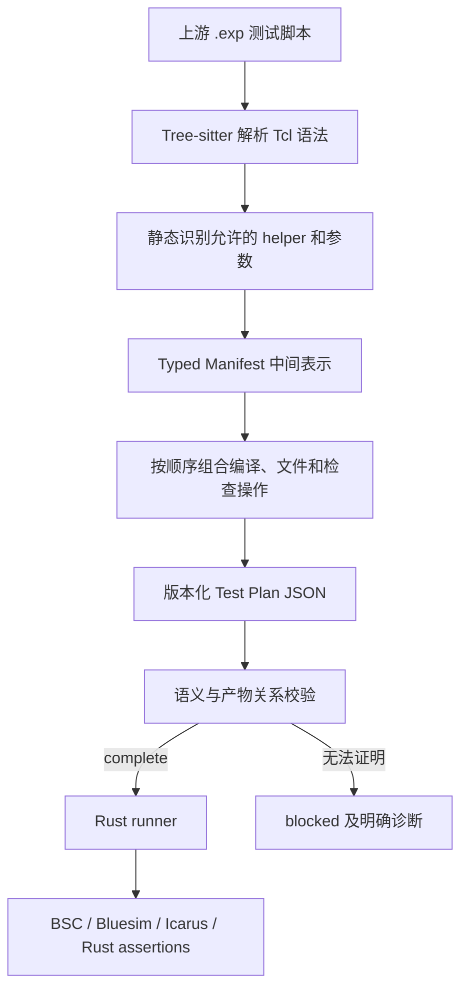
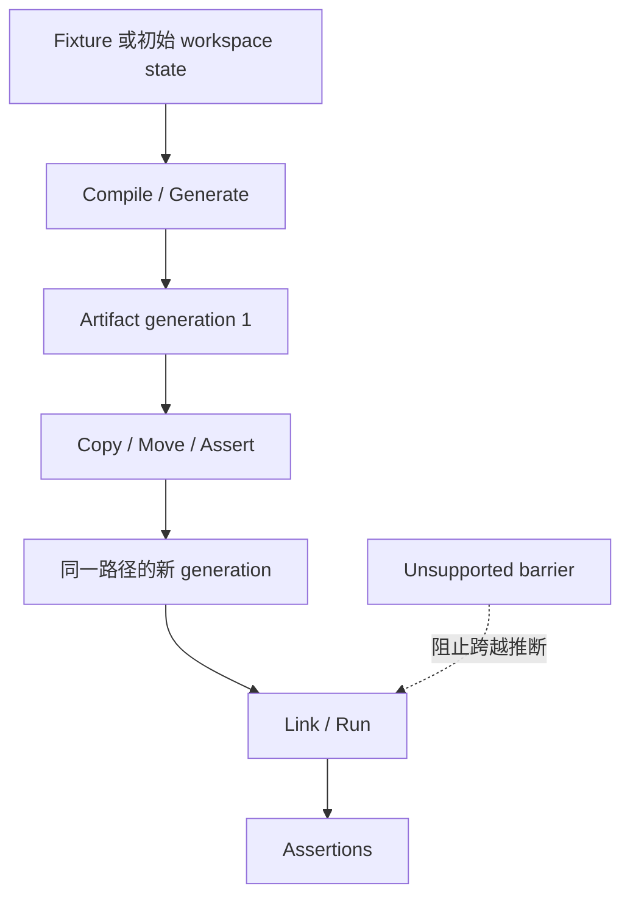

# BSC Rust 测试架构

本文解释我们为什么改造 BSC 的测试系统、原有测试如何工作，以及一份上游 Tcl 测试如何被安全地转换并由 Rust 执行。

如果你第一次接触 BSC 或这个分支，建议按顺序阅读前 7 节。维护 importer、runner 或 Test Plan schema 时，再继续阅读后面的实现细节。

> **一句话概括**：我们保留上游 `testsuite/` 作为测试意图的来源，但不在日常测试中执行其中的 Tcl；Rust 工具在更新阶段静态读取 `.exp`，生成经过验证的 JSON Test Plan，运行阶段只执行这些有限、声明式的计划。

## 1. 先认识 BSC

BSC（Bluespec Compiler）是 Bluespec SystemVerilog（BSV）的编译器。BSV 是一种用于描述硬件的高级语言。一份 BSV 设计通常有两种主要执行路线：

1. **生成 Verilog**：由 BSC 把 BSV 编译成 Verilog，再交给 Icarus Verilog 等工具仿真，或交给后续硬件工具链。
2. **使用 Bluesim**：由 BSC 生成并链接本机 C++ 仿真模型，再运行生成的可执行程序。

这个仓库里常见的名字如下：

| 名称 | 它是什么 | 在测试中的作用 |
| --- | --- | --- |
| `bsc` | BSV 编译器，主体由 Haskell 实现 | 检查源码、生成中间产物、Verilog 或 Bluesim 模型 |
| Bluesim | BSC 自带的本机仿真后端，核心运行时是 C++ | 运行 BSV 设计的本机仿真 |
| Icarus / `iverilog` / `vvp` | 开源 Verilog 编译与仿真工具 | 验证 BSC 生成的 Verilog |
| Bluetcl | BSC 提供的 Tcl 接口 | 一些上游测试用它查询编译器信息或中间表示 |
| Z3 | SMT 求解器 | BSC scheduler 的部分约束求解与相关测试 |
| `testsuite/` | BSC 上游测试集 | 包含测试脚本、BSV 源码、golden 文件和辅助输入 |

因此，“测试 BSC”不只是启动一个程序。一个测试可能依次执行：编译 BSV、保存产物、链接仿真器、运行模型、比较文本输出、检查诊断编号、比较 Verilog，或者解析 VCD 波形文件。

## 2. 原来的测试为什么难以直接用于现代 Windows CI

上游测试入口主要是 DejaGNU/Tcl `.exp` 脚本。DejaGNU 是一个历史悠久的测试框架，Tcl 是它使用的脚本语言。

这些脚本同时包含多种职责：

- 描述测试意图，例如“这个文件应该编译失败并产生 `T0001` 错误”；
- 调用 `bsc`、Bluesim、Verilog 仿真器等工具；
- `copy`、`move`、`erase` 文件；
- 处理平台条件和 capability 开关；
- 比较输出、诊断、Verilog 和 VCD；
- 调用共享 helper，使用 Tcl 控制流和动态变量。

这套测试对上游开发很有价值，但直接把 Tcl/DejaGNU 当作 Windows 日常运行时会带来几个问题：

1. **环境难分发**：DejaGNU、Tcl、Unix 工具和 shell 行为在原生 Windows 上不容易保持一致。
2. **行为不透明**：一个 helper 背后可能隐含多次工具调用和文件操作，很难在运行前审计。
3. **缓存困难**：动态脚本可以读取环境或执行任意命令，无法可靠计算测试输入和缓存身份。
4. **迁移难度不可见**：如果只是忽略不支持的 Tcl，测试可能“通过”，但实际已经漏测。
5. **安全边界过宽**：允许通用 shell、`eval` 或脚本执行，就无法保证生成计划只做我们审查过的事情。

我们的目标不是否定上游测试，也不是重新手写一套测试，而是把其中可证明的测试契约静态提取出来。

## 3. 我们改了什么，没改什么

先明确 upstream 与本分支的边界：

| 部分 | 来源 | 本次改造的原则 |
| --- | --- | --- |
| BSC 编译器、Bluesim 和原始测试素材 | 上游 BSC | 尽量保持接近上游，方便合并 `upstream/main` |
| `testsuite/**/*.exp` | 上游 BSC | 只读；作为测试契约来源，不在 Rust runner 中执行 |
| `rust/util/testsuite-manifest` | 本分支新增 | 静态解析 `.exp`，恢复有类型的测试意图 |
| `rust/util/test-plan` | 本分支新增 | 定义版本化、声明式 Test Plan 数据模型和校验规则 |
| `rust/tests` | 本分支新增 | 保存生成计划，并用 canonical Rust runner 执行 |
| `rust/util/xtask` | 本分支新增 | 实现构建、生成、审计和测试编排 |
| `pixi.toml` / `Justfile` | 本分支新增或改造 | 提供可复现 Windows 环境和简短公开入口 |

最重要的维护规则是：

- `testsuite/` 必须保持零改动，便于以后合并上游。
- 不维护第二套手写测试清单。
- 不为了让某个测试通过而按 plan ID 或文件路径写特判。
- 不为旧 Rust runner 或旧目录结构保留兼容层。

Rust 目录的整体职责见 [`../README.md`](../README.md)。本文只讨论测试迁移和执行架构。

## 4. 一条测试如何从 Tcl 变成 Rust Test Plan

下面是一个**简化示意**，不是某个具体 `.exp` 的逐字内容：

```tcl
compile_verilog_pass Counter.bsv sysCounter
compare_file sysCounter.v
```

人可以读出它的意图：

1. 用 BSC 把 `Counter.bsv` 的 `sysCounter` 模块编译为 Verilog；
2. 编译必须成功；
3. 比较生成的 `sysCounter.v` 与预期文件。

迁移系统会把这段意图转换成类似下面的声明式操作：

```text
Scenario: compile-Counter
  Fixture: Counter.bsv
  Fixture: sysCounter.v.expected

  Operation 1: bsc.compile
    mode: verilog
    source: Counter.bsv
    module: sysCounter
    expected exit: success
    declared output: sysCounter.v

  Operation 2: assert.verilog
    actual: sysCounter.v
    expected: sysCounter.v.expected
```

这里没有 Tcl，也没有 shell command string。runner 只知道两个经过 schema 定义的操作：运行一次 BSC，以及比较两份 Verilog。

如果 importer 无法证明 `sysCounter.v` 是前一个操作的产物，它不会猜测，而是把该计划标记为 `blocked`。这就是本文多次提到的 **fail-closed**：无法完整理解时拒绝执行，而不是少测一部分后仍报告成功。

完整转换流程如下：



转换发生在 `contracts-update` / `plans-update` 阶段。日常运行 Test Plan 时不会再次读取 `.exp`。

## 5. Test Plan 的基本结构

一份 `.exp` 对应一份 Test Plan。路径保留原 testsuite 层级，避免不同目录下的同名脚本发生冲突。

```text
Test Plan                         一份上游 .exp 的迁移结果
└── Scenario                      一个拥有独立临时工作目录的测试场景
    ├── Stage                     场景中的一个可报告步骤
    │   ├── Operation             一次编译、复制、运行或断言
    │   └── Operation
    └── Stage
```

可以把这些概念理解为：

- **Plan**：一份测试文件。
- **Scenario**：该文件中的一个独立实验，共享自己的 workspace。
- **Stage**：为了执行顺序、筛选和报告而划分的一组步骤。
- **Operation**：runner 真正执行的最小动作。

顺序规则很严格：

- CLI 可以并发运行不同 plan；本机建议用 `BSC_JOBS=1`。
- 同一个 plan 内的 scenario 按顺序执行。
- scenario 内的 stage 和 operation 按计划顺序执行。
- assertion 也是普通 operation，所以可以表达 `move → check → remove` 这种时序。

Test Plan 使用封闭的操作集合，例如：

```text
bsc.compile          检查或编译 BSV
bsc.generate         生成 Bluesim 或 Verilog 模型
bsc.link             链接可执行仿真模型
simulation.run       运行 Bluesim 或 Icarus 仿真
fs.copy/move/remove  严格文件操作
assert.diagnostic_count  检查 BSC 诊断数量和编号
assert.golden        比较文本输出
assert.verilog       比较 Verilog
assert.vcd           检查或比较波形
```

实际名称和字段以 `rust/util/test-plan` 生成的 [`plans/schema.json`](plans/schema.json) 为准。

明确禁止的能力包括：

- 任意 shell command string；
- Tcl、Python 或 JavaScript `eval`；
- 隐式管道、重定向和 `&&`；
- 任意动态脚本 operation。

如果确实需要支持一种新行为，应把它建模为输入、输出、超时和平台要求都明确的新 typed operation，而不是增加通用逃生口。

## 6. `complete` 和 `blocked` 到底是什么意思

每份计划只有两种状态：

### `complete`

表示 importer 已经恢复该 `.exp` 的全部有效测试行为，并且：

- 所有操作都属于 runner 支持的有限集合；
- 输入 fixture 完整；
- 操作顺序和产物关系可以证明；
- 路径、hash、平台 requirement 和 schema 校验全部通过。

只有 `complete` plan 可以执行。

### `blocked`

表示仍有部分语义无法安全表达，例如：

- Tcl 参数或控制流依赖运行时值；
- helper 还没有 typed 模型；
- 文件操作的 producer 不明确；
- 测试依赖任意 shell、Make、Perl 或 Bluetcl workflow，而对应能力尚未建模；
- importer 无法证明某个中间文件一定存在。

`blocked` 不是“跳过一个失败测试”，也不是测试失败。它是迁移工作的显式待办账本。计划会保留已恢复部分及结构化 diagnostic，但 runner 必须拒绝执行它。

当前动态清单见 [`REMAINING.md`](REMAINING.md)。不要在手写文档里长期维护第二份剩余数量。

## 7. 输入文件、产物和 provenance

这是整个架构最重要的安全基础。

### 7.1 Fixture：测试开始前已有的只读输入

fixture 可能是：

- `.bsv`、`.bs`、`.bh`、Verilog 或 C/C++ 源文件；
- `.expected` / golden 文件；
- Bluesim `.cmd` 命令文件；
- 测试运行时读取的数据文件；
- 其他经过审计的构建输入。

每个 fixture 都记录相对路径、角色和 SHA-256。runner 执行前会重新验证，因此 upstream 文件变化后不能静默运行旧计划。

每个 scenario 只复制自己实际需要的 fixture，不会偷偷复制整个测试目录。importer 会解析能够静态确定的本地 BSV package import、include 和数据文件引用，计算所需依赖闭包。

### 7.2 Artifact：测试执行过程中产生或删除的文件

每个 operation 都显式声明：

- `inputs`：执行前必须存在；
- `outputs`：成功后必须产生；
- `removals`：执行后必须消失。

例如 `bsc.generate` 声明生成 `.ba` 或 `.v`，后续 `bsc.link` 才能把它作为输入。工具进程即使返回成功，只要声明的 output 不存在，测试仍然失败。

### 7.3 Provenance：我们为什么相信这条操作

每个生成的 operation 都保留原 `.exp` 的 source span；如果行为来自 helper procedure 展开，还保留调用展开位置。这让 reviewer 能从 JSON 回到原脚本，回答：

- 这条操作来自哪一行？
- 参数是直接写的，还是 helper 展开的？
- importer 为什么把这个 assertion 绑定到这个 producer？

### 7.4 为什么不能“按经验猜产物”

BSC 可能产生 `.bo`、`.bi`、`.ba`、`.v`、C++ 或日志文件，但不是每种调用和失败路径都保证产生同样的文件。

如果 importer 凭历史经验声称某文件存在：

- 后续检查可能读到旧文件；
- cache 可能错误命中；
- Windows 与 Unix 行为差异会被掩盖；
- 测试会在没有真正覆盖目标行为时通过。

因此，只有工具语义或前序 operation 明确保证的文件才是合法 producer。

## 8. 代码分层

| 层 | 主要位置 | 职责 | 日常运行是否读取 Tcl |
| --- | --- | --- | --- |
| Tcl 静态前端 | `rust/util/testsuite-manifest` | Tree-sitter 解析、静态 lowering、helper/guard/provenance 恢复 | 否；仅更新计划时读取 |
| Importer 中间表示 | 同上 | 保存 contracts、checks、workflow actions 和 unsupported constructs | 否 |
| Test Plan 模型 | `rust/util/test-plan` | Rust 类型、JSON schema、路径和 artifact 语义校验 | 否 |
| Runner | `rust/tests/src/test_plan.rs` | workspace、fixture、工具进程、后置条件和 cache | 否 |
| CLI | `rust/tests/src/bin/bsc-test.rs` | 选择计划、进度、调度与结果汇总 | 否 |
| 任务编排 | `rust/util/xtask` | update/check/audit/build/test 等跨平台流程 | 仅生成命令会间接读取 |
| 生成物 | `rust/tests/contracts/`、`rust/tests/plans/`、`REMAINING.md` | 可审查 IR、唯一运行时计划和迁移清单 | 否 |

各层之间刻意单向依赖：

```text
.exp → manifest → Test Plan JSON → runner
```

runner 不依赖 manifest，更不依赖 Tcl parser。这保证导入逻辑再复杂，也不会扩大测试运行时的执行能力。

## 9. 静态 importer 如何理解 Tcl

### 9.1 Tree-sitter 只负责语法

Tree-sitter 生成 Tcl concrete syntax tree（CST，即保留源码结构和位置的语法树）。它能告诉我们“这里是一个命令、参数或 procedure body”，但不知道 `compile_verilog_pass` 对 BSC 意味着什么。

这些 BSC-specific 语义由 allowlisted lowerer 明确定义。lowerer 当前只接受可以静态证明的子集，例如：

- 常量 `set` 和静态 list；
- 参数全部静态的本地 procedure 调用；
- 已知 compile、simulation、assertion 和 comparison helper；
- 已知 capability guard；
- 可静态恢复的 `copy`、`move`、`erase`、`mkdir` 等 workflow action。

动态 substitution、未知命令、无法证明的控制流和外部脚本不会被执行，而会成为 `UnsupportedConstruct`。

### 9.2 Manifest 是中间表示，不是运行格式

`TestsuiteManifest` / `ScriptManifest` 保存 lowerer 恢复的：

- compile/simulation contracts；
- assertions 和 comparisons；
- filesystem/workflow actions；
- guard 和源码顺序；
- unsupported constructs。

它帮助开发者区分 blocker 位于哪一层：

1. Tcl 语法还没静态 lower；
2. 行为已识别，但没有 typed Test Plan operation；
3. operation 已存在，但 producer/consumer 关系无法证明；
4. plan 完整，但运行暴露出 BSC 或平台问题。

manifest 只是 importer IR。运行器的唯一输入仍是 Test Plan JSON。

## 10. Workflow composition 为什么复杂

上游 `.exp` 经常把一个完整场景写成多个相邻 helper：

```text
compile source A
copy artifact
compile source B
link objects
run simulator
compare output
remove temporary file
```

lowerer 可以分别识别这些动作，但 importer 还必须证明它们属于同一个 workspace 和同一条执行链。

当前 `plan.rs` 使用多组通用、有序的 composition pass，例如：

- stateful simulation episode；
- compile chain；
- trailing / idempotent filesystem action；
- multi-compile Verilog workflow；
- ordered Bluesim link；
- assertion/comparison producer binding。

这些 pass 不按测试文件名分支。它们检查：

- 动作在原脚本中的先后顺序；
- guard/capability 是否兼容；
- input 是否有唯一 producer；
- 中间是否存在 unsupported barrier；
- 动作是否已经被其他 scenario 消费。

候选 workflow 会先在临时副本上完整构建和验证，只有全部成立才原子提交，避免失败候选污染后续组合。

### 目前有意保持 blocked 的典型情况

- `link_verilog_pass "*.v" ...`：不能读取 host 工作目录来动态展开 glob。
- 多次把不同源码复制到同一个 workspace 路径：裸路径无法表达“第一版”和“第二版”文件。
- 依赖失败编译后偶然留下的 `.bi/.bo`：没有稳定 producer 契约。
- 动态修改并恢复宿主环境变量：需要 typed、隔离且进入 cache identity 的环境模型。

这些限制看起来保守，但能避免 stale artifact、跨场景环境泄漏和错误 cache hit。

## 11. 目标演进：统一的 versioned action graph

当前 composition passes 是可验证的过渡实现，但继续增加 pass 会让 producer 推导分散。长期目标是把 importer 恢复的事件放入一个统一、有版本的 action graph。



关键思想是：workspace path 不是身份本身。

例如 `TopLevel.bsv` 先由 fixture 写入，之后又被 `copy` 覆盖。虽然路径相同，但这是两个不同 generation。后续 compile 应连接到正确版本，而不能简单寻找“最近一个同名文件”。

目标图模型必须满足：

1. 路径写入具有 generation identity；
2. 边同时考虑 artifact、源码顺序、guard 和副作用；
3. unsupported 行为是一等 barrier；
4. 候选组件验证后原子提交；
5. 不削弱公开 `fs.copy` / `fs.move` 的严格语义；
6. artifact version、fixture 和 typed environment 全部进入 cache identity。

图模型能解决“同一路径被有序覆写”一类 workflow，但不会自动使所有计划 complete。没有真实工具契约的 `.bi/.bo` 仍然不能凭空成为产物。

## 12. Runner 如何执行一份 complete plan

`bsc-test` 对每个可执行 scenario 依次完成：

1. 反序列化 Test Plan，并执行 schema 和 semantic validation；
2. 拒绝 `blocked` plan；
3. 验证原 `.exp` 的 SHA-256；
4. 验证该 scenario 使用的 fixture 路径和 SHA-256；
5. 创建隔离 workspace，只 stage 声明的 fixture；
6. 按顺序启动 BSC、Bluesim、Icarus 或执行 Rust assertion；
7. 每步验证 declared inputs、outputs 和 removals；
8. 全部成功后，按规则写入持久 cache。

外部工具使用 Rust `std::process::Command` 和 argv 数组启动，不经过 shell。每类阶段有明确 timeout。平台能力由 typed `requires` 表达；当前平台不满足时，runner 明确报告 `SKIP`，不会改写计划或只执行一半。

### 预期失败与 XFAIL

“编译预期失败”是普通测试契约：如果 BSC 正确拒绝输入，测试通过。

XFAIL 表达的是另一件事：上游知道当前实现存在 bug，因此某个本应通过的 operation 暂时预期失败。它必须保留 XPASS 检查——如果 bug 已修复，计划应报告意外通过，提示维护者移除旧 bug 标记。

XFAIL 只能消费明确的契约不匹配；进程启动失败、timeout、文件读取失败等基础设施错误不能被伪装成 XFAIL。

## 13. 缓存与临时文件

完整冷测包含大量重复 BSC 编译，因此系统使用两层缓存：

- `sccache`：缓存 Rust 和 Bluesim C/C++ 编译结果；
- scenario result cache：缓存测试场景成功后的 assertion snapshots。

关键目录：

```text
.pixi/cache/rust-tests/scenario-results/  持久场景结果
.pixi/tmp/rust-test-*                     可删除的 workspace 和诊断
.pixi/tmp/benchmarks/                     长测试日志
```

scenario cache 不保存整个工作目录。它主要保存成功标记和 assertion 时刻的被测文件快照；普通 `.bo`、`.ba`、object 和 executable 不会因为曾经存在就永久保存。若 Verilog、C++ 或 VCD 本身是 assertion 对象，则保存对应快照。

cache hit 只读地重放 assertion，不允许测试修改 persistent cache。scenario JSON、fixture、工具链、相关环境和 artifact contract 都参与 cache identity。

可用以下入口验证或清理：

```sh
BSC_JOBS=1 pixi run just test-cold
BSC_JOBS=1 pixi run just test-prune
pixi run just sccache-stats
```

## 14. Source of truth 与生成物

| 内容 | Source of truth | 是否手改 |
| --- | --- | --- |
| 上游测试意图 | `testsuite/**/*.exp` 及其 fixture | 不改 |
| 静态 importer IR 快照 | `rust/tests/contracts/upstream-contracts.json` | 不手改，由命令生成 |
| 运行时测试计划 | `rust/tests/plans/index.json` 与 `**/*.test.json` | 不手改，由命令生成 |
| JSON Schema | `rust/tests/plans/schema.json` | 不手改，由 Rust model 生成 |
| 剩余迁移清单 | `rust/tests/REMAINING.md` | 不手改，由 inventory 生成 |
| 数据模型 | `rust/util/test-plan` | 代码审查后显式升级 schema |
| Tcl 语义和 importer | `rust/util/testsuite-manifest` | 代码和单元测试共同维护 |

schema 变化必须显式升级版本，不能让同一版本的 JSON 静默改变语义。当前代码中的 Test Plan schema version 是 **24**，manifest schema version 是 **20**；动态状态应以生成物和检查命令为准。

当前提交的生成计划快照为：

```text
860 plans
764 complete / 96 blocked
5201 scenarios / 5522 stages / 22596 operations
952 import diagnostics
```

这些数字用于帮助理解规模，不是手工维护的完成标准。最新 blocker 分类始终以 [`REMAINING.md`](REMAINING.md) 为准。

## 15. 常用维护流程

公开入口放在 `Justfile`，复杂实现位于 `cargo xtask`。Pixi 提供固定依赖和环境。

### 更新 importer 生成物

```sh
BSC_JOBS=1 pixi run just contracts-update
BSC_JOBS=1 pixi run just plans-update
BSC_JOBS=1 pixi run just inventory-update
```

### 检查生成物没有过期

```sh
BSC_JOBS=1 pixi run just contracts-check
BSC_JOBS=1 pixi run just plans-check
BSC_JOBS=1 pixi run just plans-audit
BSC_JOBS=1 pixi run just inventory-check
```

### 运行测试

```sh
# 完整入口
BSC_JOBS=1 pixi run just test

# 所有 complete plans
BSC_JOBS=1 pixi run just test-plans

# 一份指定计划
BSC_JOBS=1 pixi run just test-plans bsc.bluesim/interactive/interactive --exact

# Rust library tests
BSC_JOBS=1 pixi run rtk test cargo test --locked \
  -p bsc-test-plan -p bsc-testsuite-manifest -p bsc-rust-tests \
  --lib --jobs 1 -- --test-threads 1
```

本项目的 BSC 测试较重。在 Windows/Zed 中统一使用单线程：

```text
BSC_JOBS=1
Cargo --jobs 1
Rust test --test-threads 1
```

长输出应写入 `.pixi/tmp/benchmarks/`。不要为了减少日志而隐藏失败详情；RTK 的完整 tee 日志可用于进一步诊断。

### 合并上游后

```sh
git fetch upstream
git merge upstream/main
BSC_JOBS=1 pixi run just contracts-update
BSC_JOBS=1 pixi run just plans-update
BSC_JOBS=1 pixi run just inventory-update
git diff -- testsuite rust/tests/contracts rust/tests/plans rust/tests/REMAINING.md
```

最终必须确认：

```sh
git diff --check
git diff --exit-code -- testsuite
```

## 16. 修改 importer 时的判断顺序

遇到一个 blocked `.exp`，不要立刻添加新 operation。按下面顺序定位问题：

1. **语法层**：Tree-sitter 是否正确解析，source span 是否可靠？
2. **静态 lowering 层**：helper 和参数能否在不执行 Tcl 的前提下恢复？
3. **typed model 层**：现有 operation 能否准确表达它？
4. **组合层**：producer、consumer、顺序、guard 和 barrier 是否可证明？
5. **fixture 层**：所有输入是否有唯一、安全、带 hash 的来源？
6. **runtime 层**：Windows 上工具实际行为是否符合计划？
7. **回归层**：新增模型是否批量适用于同类脚本，而不是只服务一个 origin？

一个理想改动通常会：

- 解锁一类 helper 或 workflow，而不是一个文件；
- 保留完整 provenance；
- 对动态参数 fail-closed；
- 添加正向、歧义、barrier 和错误参数测试；
- 更新生成物后产生可审查、确定性的 diff；
- 不修改 `testsuite/`。

## 17. 术语表

| 术语 | 本文中的含义 |
| --- | --- |
| upstream | 官方 `B-Lang-org/bsc` 仓库及其原始内容 |
| `.exp` | DejaGNU 使用的 Tcl 测试脚本 |
| CST | concrete syntax tree，保留源码结构和位置的语法树 |
| lower / lowering | 把 Tcl 语法节点转换成有限、强类型测试语义的过程 |
| importer | 从 `.exp` 生成 manifest 和 Test Plan 的 Rust 代码 |
| manifest / IR | importer 使用的中间表示，不是 runner 输入 |
| Test Plan | 版本化、声明式、可校验的 JSON 测试计划 |
| fixture | 测试开始前已有的只读输入文件 |
| artifact | operation 在 workspace 中读取、生成或删除的文件 |
| producer | 明确声明生成某个 artifact 的前序 operation |
| consumer | 使用某个 fixture 或前序 artifact 的 operation |
| provenance | operation 与原 `.exp` 源码位置、helper 展开的对应关系 |
| guard | capability 或平台条件，例如只在 Verilog 测试启用时执行 |
| barrier | 阻止 importer 跨越推断 workflow 的未知或未消费行为 |
| golden | 预先保存的期望输出，用于和实际结果比较 |
| VCD | Value Change Dump，数字电路仿真的波形文件 |
| fail-closed | 无法完整理解或验证时拒绝执行，而不是忽略未知部分 |
| XFAIL / XPASS | 已知 bug 导致的预期失败 / bug 修复后出现的意外通过 |

## 18. 进一步阅读

- [`README.md`](README.md)：如何运行 Rust 测试和缓存说明。
- [`REMAINING.md`](REMAINING.md)：自动生成的剩余迁移清单。
- [`TEST_PLAN.md`](TEST_PLAN.md)：Test Plan 的历史设计背景；其中旧统计不代表当前状态。
- [`../util/testsuite-manifest/README.md`](../util/testsuite-manifest/README.md)：Tree-sitter Tcl 前端与 lowering 实现细节。
- [`../util/test-plan/README.md`](../util/test-plan/README.md)：Test Plan crate 的模型说明。
- [`../README.md`](../README.md)：整个 Rust workspace 的目录职责和长期演进方向。
